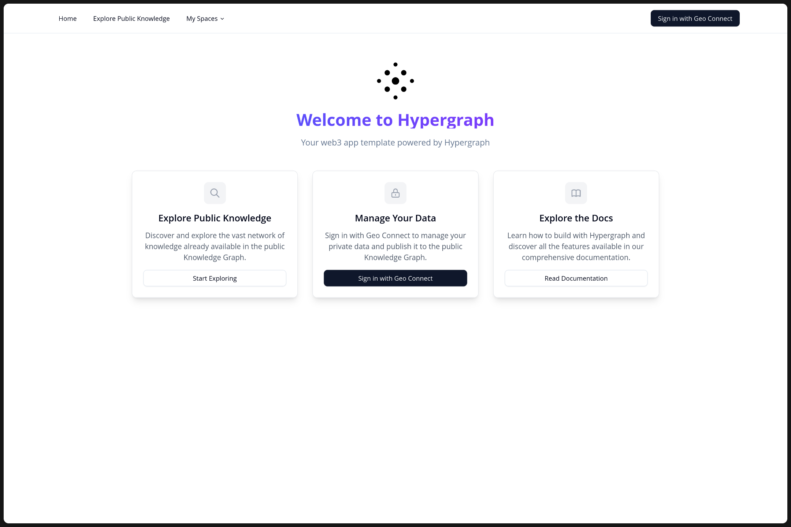
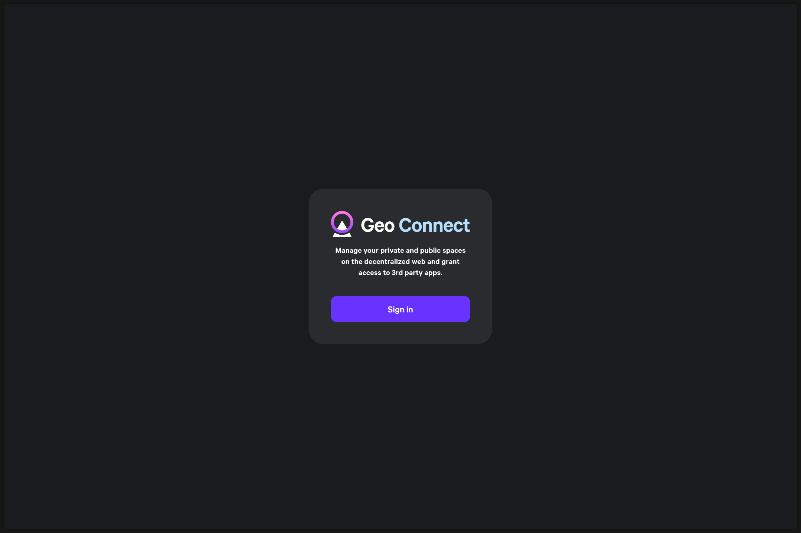
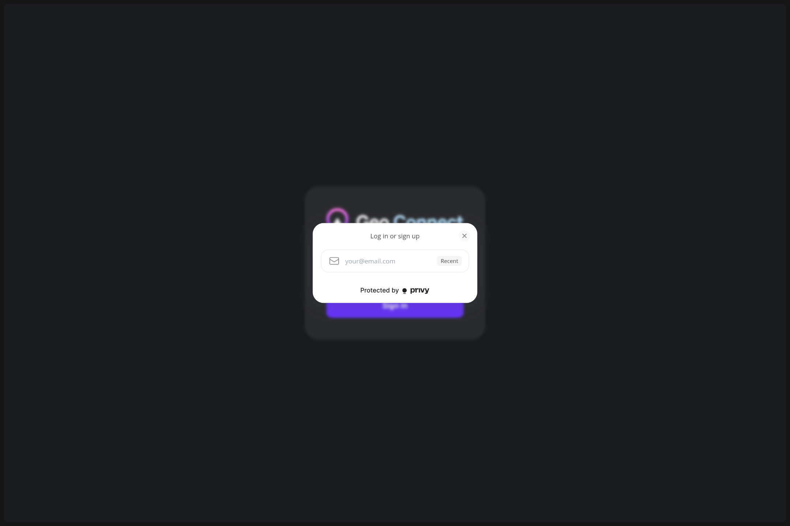
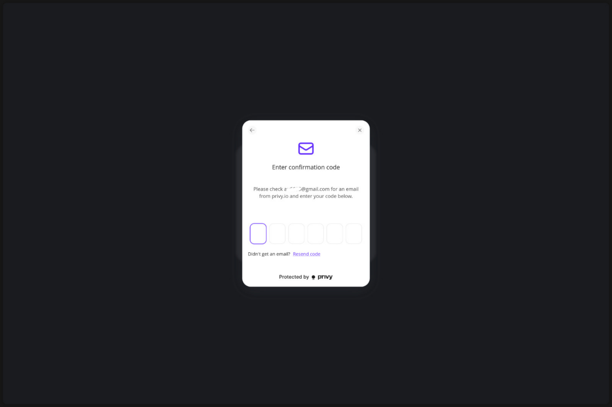
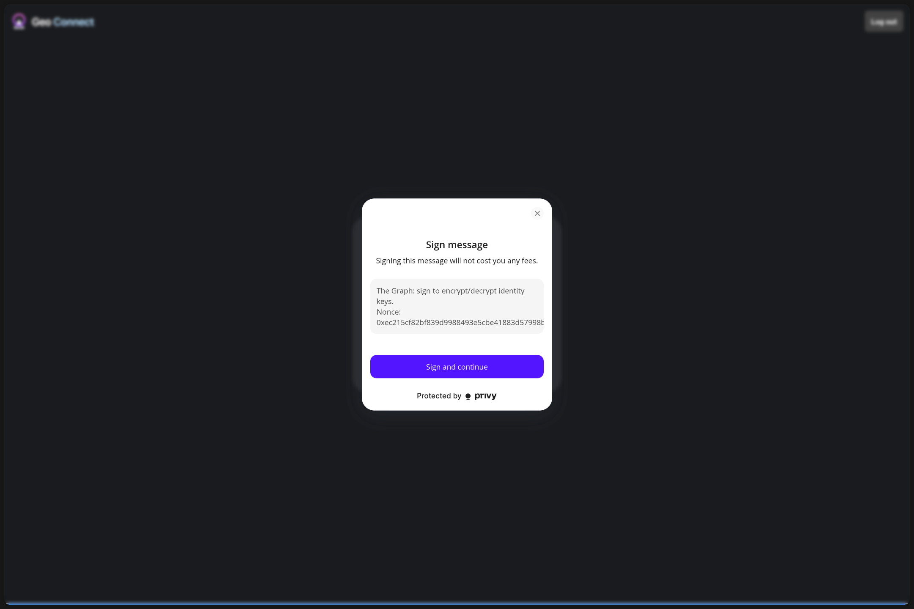
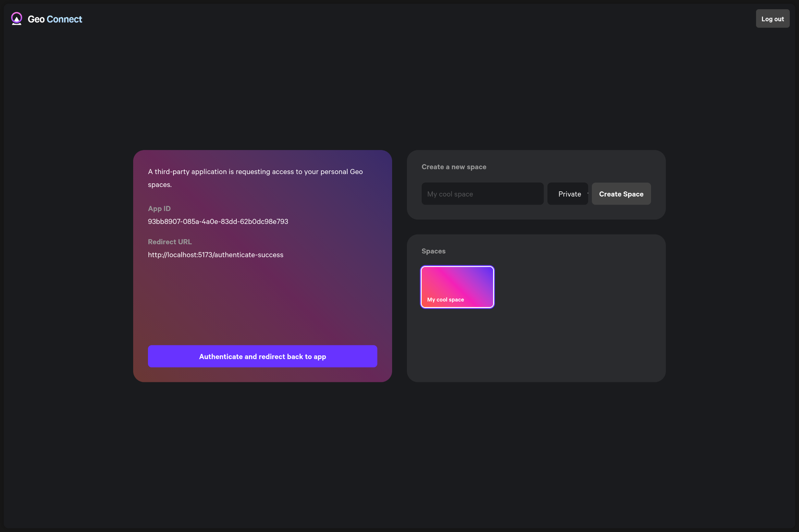

# Authentication

## Geo Connect

The default and recommended way to authenticate is via Geo Connect. Geo Connect is a dedicated application hosted by the GeoBrowser team. Through Geo Connect you can authenticate with your GeoBrowser account and use it to selectively delegate access to your private and public spaces.

If you create you application using TypeSync or use the [hypergraph-app-template](https://github.com/geobrowser/hypergraph-app-template) the full authentication flow is already implemented for you.

In the connect app you can create spaces. In the near future you will be able to delete private spaces and you also will be able to give an app permissions to create new private and/or public spaces.

## Hypergraph API

```tsx
import { useHypergraphAuth } from "@graphprotocol/hypergraph-react";

function RouteComponent() {
  const { authenticated, identity } = useHypergraphAuth();
}
```

- `authenticated` - a boolean indicating if the user is authenticated
- `identity` - the identity of the logged in user

## Authentication Flows with Geo Connect

### Signup coming from an App (without an existing Geo account)

1. User is opening App (Running App)

2. Clicks on "Sign in/Sign up with Geo"
   - Redirect to Connect

3. Sign up for Connect -> Email + One-time Code



4. Connect: "Do you authorize this app (App ID, redirect URL)"
   - Select spaces
   - Click "Authorize" -> Redirect to App

5. You are logged into the app with your account

### Signup coming from an App (with an existing Geo account)

1. User is opening App (Running App)

2. Clicks on "Sign in/Sign up with Geo"
   - Redirect to Connect

3. Login in the connect App -> Email + One-time Code


4. Connect: "Do you authorize this app (App ID, redirect URL)"
   - Select spaces
   - Click "Authorize" -> Redirect to App

5. You are logged into the app with your account

### Login coming from an App (user is logged out from app and connect)

1. User is opening App (Running App)

2. Clicks on "Sign in/Sign up with Geo"
   - Redirect to Connect

3. Login in the connect App -> Email + One-time Code


4. Do you want to login with this app? (App ID, redirect URL)
   - Select spaces (optional)
   - Click "Authorize" -> Redirect to App

5. You are logged into the app with your account

### Login coming from an App (user is logged out from app and logged in to connect)

1. User is opening App (Running App)

2. Clicks on "Sign in/Sign up with Geo"
   - Redirect to Connect

3. Do you want to login with this app? (App ID, redirect URL)
   - Select spaces (optional)
   - Click "Authorize" -> Redirect to App

4. You are logged into the app with your account

## Geo Connect API

### `redirectToConnect`

```tsx
import { useHypergraphApp } from "@graphprotocol/hypergraph-react";

function Login() {
  const { redirectToConnect } = useHypergraphApp();
  return (
    <button
      onClick={() => {
        redirectToConnect({
          storage: localStorage,
          connectUrl: "https://connect.geobrowser.io/",
          successUrl: `${window.location.origin}/authenticate-success`,
          // your app id (any valid uuid)
          appId: "93bb8907-085a-4a0e-83dd-62b0dc98e793",
          redirectFn: (url: URL) => {
            window.location.href = url.toString();
          },
        });
      }}
    >
      Authenticate with Connect
    </button>
  );
}
```

### `processConnectAuthSuccess`

```tsx
import { useHypergraphApp } from "@graphprotocol/hypergraph-react";

function RouteComponent() {
  const { ciphertext, nonce } = Route.useSearch(); // get the ciphertext and nonce from the URL
  const { processConnectAuthSuccess } = useHypergraphApp();
  const navigate = useNavigate();
    const isProcessingRef = useRef(false);

  useEffect(() => {
    if (isProcessingRef.current) return; // prevent multiple calls from useEffect double calling in StrictMode
    const result = processConnectAuthSuccess({ storage: localStorage, ciphertext, nonce });
    if (result.success) {
      isProcessingRef.current = true;
      navigate({ to: '/', replace: true });
    } else {
      alert(result.error);
    }
  }, [ciphertext, nonce, processConnectAuthSuccess, navigate]);

  return <div>Authenticating …</div>;
}
```
