# 🧠 Core Concepts

Hypergraph re-imagines traditional client–server apps as **local-first**, **peer-syncing** knowledge graphs. Understanding the following building blocks will help you design applications that feel real-time, privacy-preserving, and interoperable by default.

## Table of Contents

- [Knowledge Graphs](#knowledge-graphs)
- [Hypergraph SDK](#hypergraph-sdk-in-action)
- [Spaces](#spaces)
- [Identities](#identities)
- [Inboxes](#inboxes)
- [Events & CRDTs](#events--crdts)
- [Security Model](#security-model)
- [GRC-20: The Protocol Under the Hood](#grc-20-the-protocol-under-the-hood)

---
## Knowledge Graphs

Traditional databases store data in rows and columns. Knowledge graphs store data as **networks of connected information**—think of it like a mind map where every piece of information can link to any other piece.

### Why Knowledge Graphs?

Imagine you're building a social app. In a traditional database, you might have separate tables for `users`, `posts`, and `likes`. But what if you want to find "posts by photographers that my friends liked"? That requires complex joins across multiple tables.

In a knowledge graph, the relationships *are* the data:

```mermaid
graph LR
  Teresa[👩 Teresa] -->|profession| Photography[📸 Photography]
  Teresa -->|owns| Camera[📷 Fujifilm X100]
  Teresa -->|posted| Photo[🖼️ Street Photo]
  Alex[👨 Alex] -->|friend_of| Teresa
  Alex -->|liked| Photo
```



This makes complex queries natural and fast. Plus, your data model can evolve organically—just add new types of entities and relationships without schema migrations.

### The Hypergraph Advantage

Hypergraph takes knowledge graphs further by making them:

- **🔒 Private by default** — Your personal data stays encrypted on your device
- **🌐 Peer-to-peer** — No central server required; collaborate directly with friends
- **⚡ Real-time** — Changes sync instantly across all your devices
- **🔗 Interoperable** — Your data works across different apps that speak the same protocol

> **The magic:** Under the hood, Hypergraph serializes everything using the **GRC-20** standard. As a developer, you just work with simple SDK calls—Hypergraph handles the complex cryptography and networking. If you're curious about the low-level details, check out the [GRC-20 section](#grc-20-advanced) below.

## Hypergraph SDK in Action

Let's build that photographer example step by step:

```ts
import { useHypergraph } from '@graphprotocol/hypergraph-react';

function CreateProfile() {
  const { createEntity, createRelation } = useHypergraph();

  const handleCreateProfile = async () => {
    // 1️⃣ Create Teresa as a person
    const teresa = await createEntity({
      name: 'Teresa',
      type: 'Person',
      properties: {
        profession: 'photographer',
        bio: 'Street photographer based in Tokyo'
      }
    });

    // 2️⃣ Create her camera
    const camera = await createEntity({
      name: 'Fujifilm X100V',
      type: 'Camera',
      properties: {
        brand: 'Fujifilm',
        model: 'X100V'
      }
    });

    // 3️⃣ Connect them with an "owns" relationship
    await createRelation({
      from: teresa.id,
      to: camera.id,
      type: 'owns',
      properties: {
        purchaseDate: '2023-06-15'
      }
    });
  };

  return <button onClick={handleCreateProfile}>Create Profile</button>;
}
```

That's it! Behind the scenes, Hypergraph:
- Generates unique IDs for each entity
- Encrypts the data (if in a private Space)
- Syncs changes to all connected devices
- Makes everything queryable via GraphQL

**Next:** Learn about [Spaces](#spaces)—how Hypergraph organizes people and data into collaborative groups.

<!-- GRC-20 deep-dive moved to the bottom of the doc -->

## Spaces

A **Space** is the fundamental unit of collaboration.

* Think of it as a **folder**, **Slack channel**, or **Google Doc**—it groups both *people* and *data*.
* Each Space maps 1-to-1 with an **Automerge** document for conflict-free offline editing.
* Membership & roles (`member`, `editor`, `admin`) are tracked by an append-only _Space Event Log_.

### Lifecycle events

| Event | Purpose |
|-------|---------|
| `createSpace` | Bootstrap a new Space and establish its first encryption key. |
| `deleteSpace` | Mark the Space as deleted (soft delete). |
| `updateMember` | Promote or demote a member role. |
| `removeMember` | Kick a member and rotate keys. |
| `createInvite` / `acceptInvite` | Securely invite users—keys are boxed to the invitee's public key. |

All events are **signed** by the author and **verified** by the sync server before broadcast.

## Identities

Every user controls an **Identity** defined by three asymmetric keypairs:

1. **Signature keys** — Ed25519 keys used to sign Space Events.
2. **Encryption keys** — X25519 keys used to encrypt private Space data.
3. **Account keys** — An EVM account (via wallet) used for SIWE authentication.

Identities are encrypted with a **session token** and stored in the browser (`localStorage`, IndexedDB, or the filesystem in React Native). This keeps the SDK _stateless_—you can log in on multiple devices without a backend.

## Inboxes

An **Inbox** is a lightweight message queue that delivers updates or DMs.

* **Account Inboxes** belong to a single user.
* **Space Inboxes** broadcast to all members of a Space.

Inboxes can be **public** (anyone can read) or **private** (E2EE). Auth policies decide who may send:

```ts
type InboxSenderAuthPolicy = 'any' | 'members' | 'admins';
```

## Events & CRDTs

1. A client mutates the Automerge document (`doc.put(…​)`).
2. The SDK encodes the change as **CRDT updates**.
3. Updates are encrypted with the current **spaceKey** and batched into a `sendUpdate` event.
4. The sync server verifies, persists, and broadcasts updates to online peers.
5. Peers apply the updates; conflicts resolve automatically.

When the event log grows large, a peer may emit `sendCompactedUpdate`—a snapshot that starts a fresh log segment.

## Security Model

| Threat | Mitigation |
|--------|-----------|
| Server reads private data | **E2EE** — all document updates are encrypted client-side with a per-Space symmetric key. |
| Forged events | **Signature verification** for every event using the author's public key. |
| Stale clients | Each event carries `lastKnownSpaceEventId`; server rejects out-of-date mutations. |
| Key leakage on member removal | **Key rotation** through `removeMember` → generates a new `spaceKey`. |

## GRC-20: The Protocol Under the Hood

> **⚠️ Advanced Section:** You don't need to understand GRC-20 to build with Hypergraph! This is for developers who want to understand the underlying protocol or need low-level access to the knowledge graph.

Think of GRC-20 as the "assembly language" of knowledge graphs. While Hypergraph gives you high-level React hooks and intuitive APIs, GRC-20 defines the precise data format that makes everything interoperable.

### Why Does GRC-20 Exist?

Imagine if every social app stored data differently—Instagram used JSON, TikTok used XML, Twitter used CSV. Your photos, posts, and connections would be trapped in silos forever.

GRC-20 solves this by creating a **universal format** for knowledge. Any app that speaks GRC-20 can read, write, and build upon data created by any other GRC-20 app.

### The Five Building Blocks

Let's decode the sentence *"Teresa, a photographer, owns a Fujifilm camera"* into its GRC-20 components:

| **English** | **GRC-20 Term** | **What It Represents** |
|-------------|-----------------|------------------------|
| "Teresa" | **Entity** | A unique thing in the graph |
| "photographer" | **Value** | A piece of data attached to an entity |
| "profession" | **Property** | The type/schema of a value |
| "Person" | **Type** | The category an entity belongs to |
| "owns" | **Relation** | A connection between two entities |

### Raw GRC-20 Code

Here's how that sentence looks when written directly with the [`@graphprotocol/grc-20`](https://www.npmjs.com/package/@graphprotocol/grc-20) library:

```ts title="Low-level GRC-20 example"
import { Graph } from '@graphprotocol/grc-20';

// 1️⃣ Define your schema IDs (normally auto-generated)
const PERSON_TYPE = 'schema:type:person';
const CAMERA_TYPE = 'schema:type:camera';
const PROFESSION_PROP = 'schema:property:profession';
const BRAND_PROP = 'schema:property:brand';
const OWNS_RELATION = 'schema:relation:owns';

// 2️⃣ Create entities with their properties
const { id: teresaId, ops: teresaOps } = Graph.createEntity({
  name: 'Teresa',
  types: [PERSON_TYPE],
  values: [
    { property: PROFESSION_PROP, value: 'photographer' }
  ]
});

const { id: cameraId, ops: cameraOps } = Graph.createEntity({
  name: 'Fujifilm X100V',
  types: [CAMERA_TYPE],
  values: [
    { property: BRAND_PROP, value: 'Fujifilm' }
  ]
});

// 3️⃣ Create the relationship
const { ops: relationOps } = Graph.createRelation({
  fromEntity: teresaId,
  toEntity: cameraId,
  relationType: OWNS_RELATION
});

// 4️⃣ Bundle everything into a single "edit"
const allOperations = [...teresaOps, ...cameraOps, ...relationOps];

// 5️⃣ Publish to the network (IPFS, blockchain, etc.)
await Graph.publishEdit({ ops: allOperations });
```

### When Would You Use GRC-20 Directly?

Most developers should stick with the Hypergraph SDK! But you might drop down to GRC-20 if you're:

- **Building infrastructure tools** (indexers, validators, etc.)
- **Migrating data** from other formats into the knowledge graph
- **Creating custom query engines** that need maximum performance
- **Debugging issues** at the protocol level

For typical app development, Hypergraph's React hooks and high-level APIs are much more convenient and handle all the GRC-20 complexity for you.

---

**Want to learn more?** Read the full [GRC-20 specification](https://github.com/graphprotocol/graph-improvement-proposals/blob/main/grcs/0020-knowledge-graph.md) on GitHub.

---

### Edit on GitHub

[✏️ Suggest changes](https://github.com/graphprotocol/hypergraph/edit/main/docs/docs/core-concepts.md) 

:::tip Best Practice
**Always check for an existing relation (by `from`, `to`, and `relationType`) before creating a new one.**

This prevents duplicate relations, keeps your data model clean, and avoids ambiguity in queries and UI. The GRC-20 SDK will create a new relation entity every time unless you check first.
:::

:::info Terminology Update
In the latest GRC-20 spec, what were previously called "triples" are now called "values." The "value type" is now called "data type," and data types are defined on the property, not the value. This change makes the model simpler and validation more robust.
:::

**Note:** The data service validates that each value matches the property's data type.

