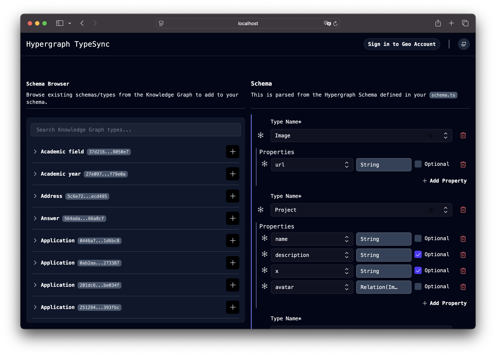
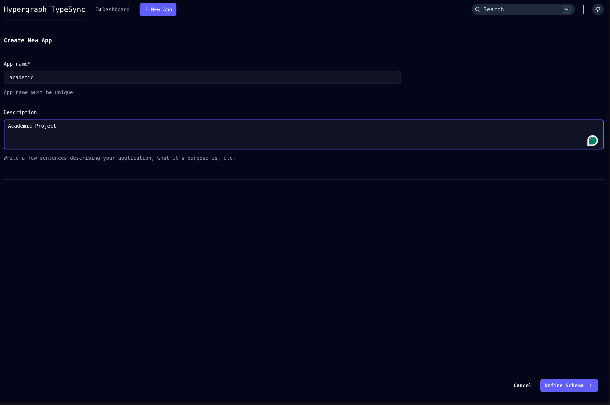
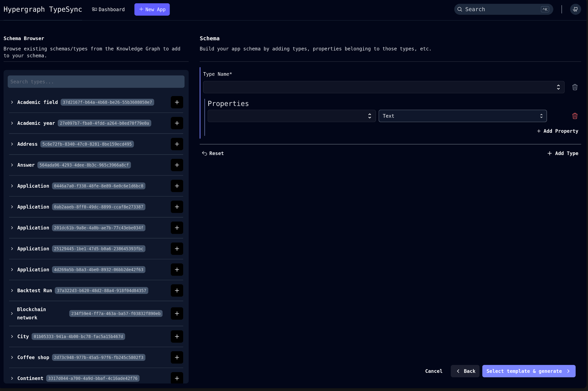
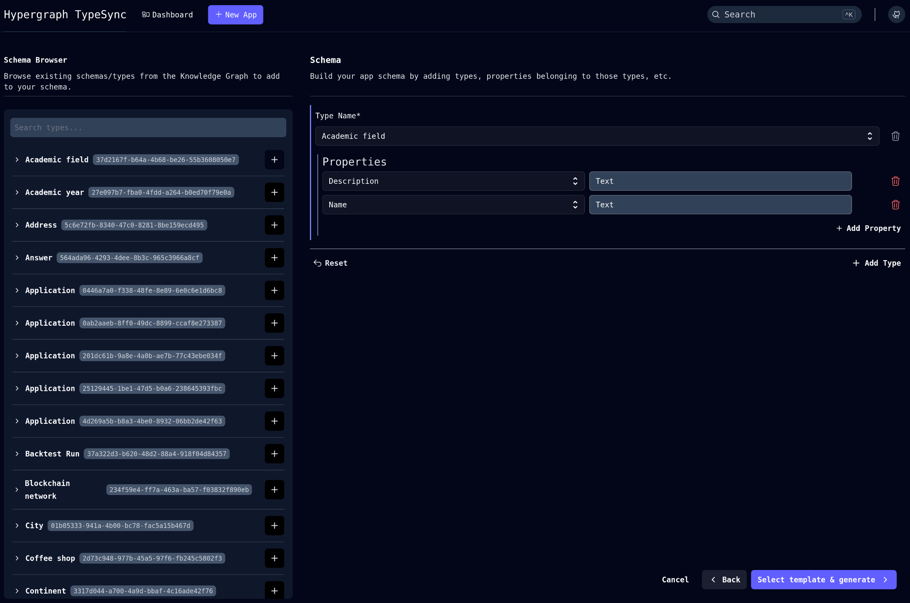
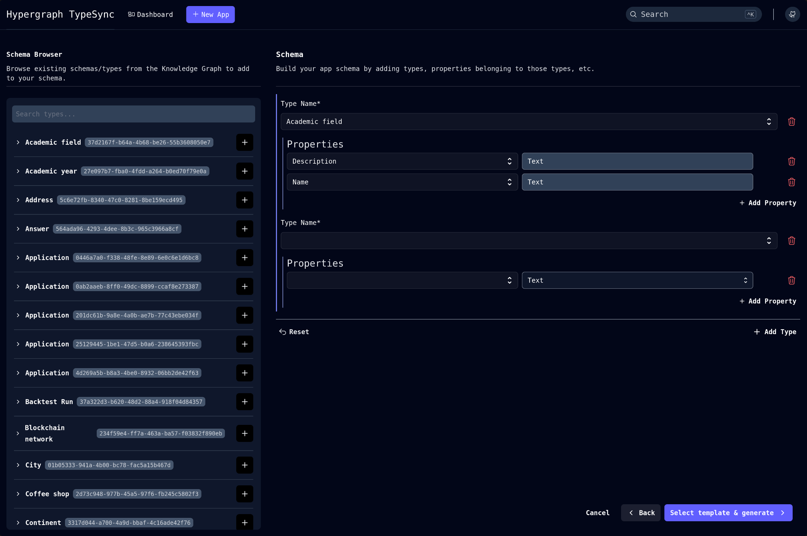
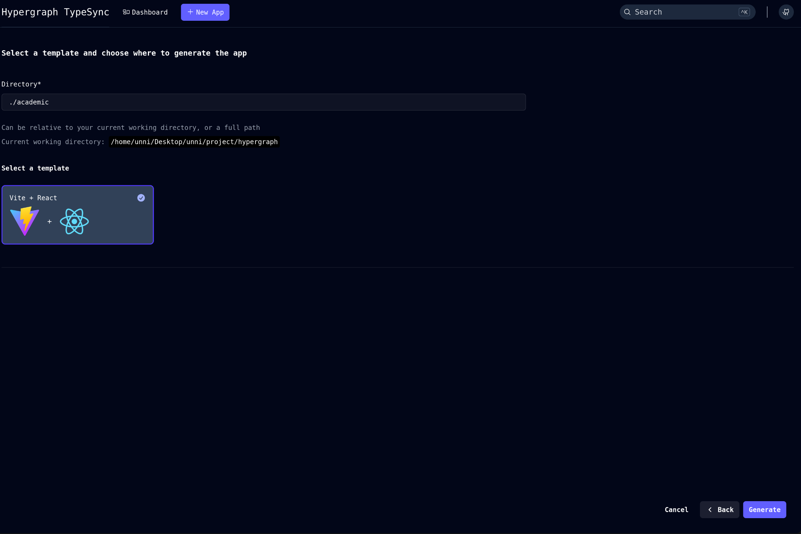
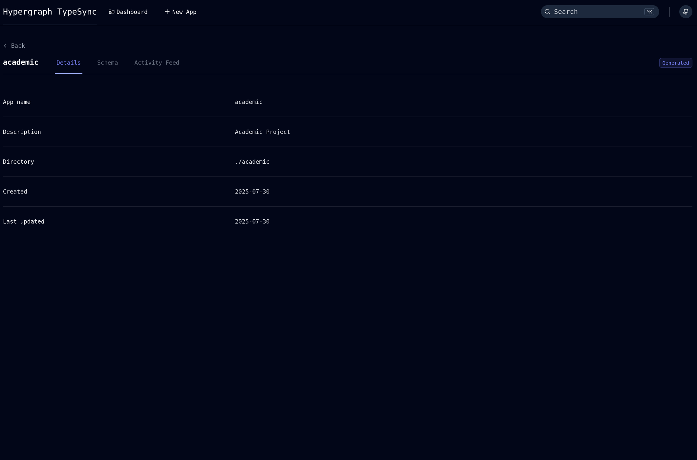
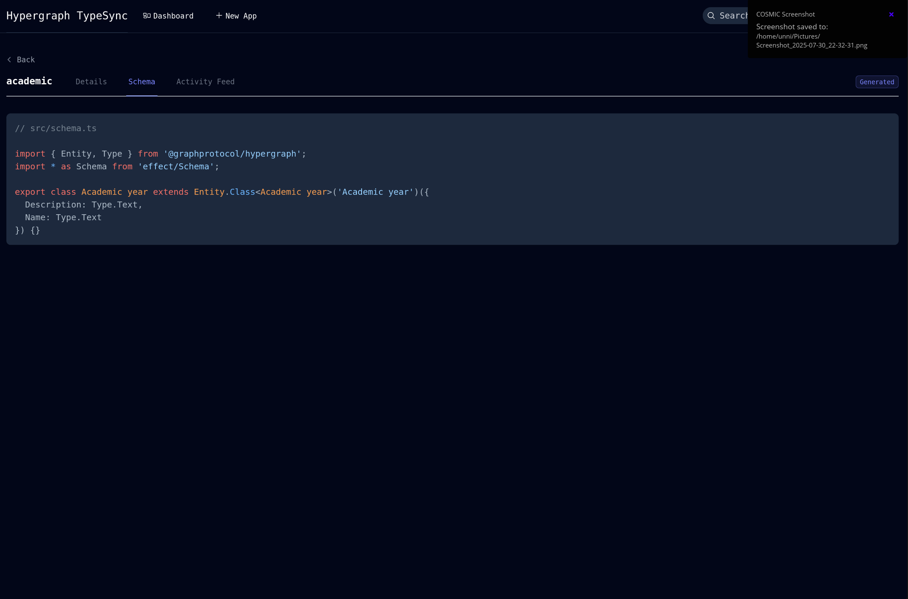

# 🧬 TypeSync
To create an app with custom data types, you can use the `TypeSync`, fully-functional React application powered by Hypergraph using our scaffolding tool. In just a few minutes, you'll have a local development environment up and running.
## Pre-requisites
- Node.js >= 22
- pnpm >= 10 (Install with `npm install -g pnpm`)
- Git SSH Setup (for cloning the repo)

## Installation
First install the Hypergraph CLI.
```
pnpm install -g @graphprotocol/hypergraph-cli@latest
```
Approve the building scripts by running the following command:
```
pnpm approve-builds -g
```

Selecting all the options by pressing `a` followed by `Yes`


## Launching TypeSync
TypeSync is a visual tool that helps you define your data schema and then generates a complete starter application based on your design. Launch it with
```
hg typesync --open
```
This will start the TypeSync server. You can now access the TypeSync app in your browser at ```http://localhost:3000```.



## Scaffold Your First Application
In the TypeSync Studio:
1. **Create a New Application**: Click on "New App" to start a new application. Give it a name and description.

2. **Browse Your Schema**: Use the Schema Browser to explore existing data types or create new ones. 

3. **Select Schema**: Choose the data types you want to include in your application. You can select multiple types or create new ones by clicking "Add Type". Click on "Select Template & Generate".


4. **Generate Application**: After selecting your schema, click on "Generate App". TypeSync will create a complete React application with the selected data types.



5. **Run Your Application**: Once the app is generated, you can run it locally. Navigate to the generated app directory and run:
    ```
    cd <your-app-name>
    pnpm install
    pnpm dev
    ```
This will start the application, and you can view it in your browser at `http://localhost:5173`.
You're all set! You can now start building your application by editing the files in the ```src``` directory. The generated ```src/schema.ts``` file contains the Hypergraph schema you defined in TypeSync.

Example of the generated schema (```src/schema.ts```):
```typescript
import type { Mapping } from '@graphprotocol/hypergraph';
import { Id } from '@graphprotocol/hypergraph';

export const mapping: Mapping = {
  AcademicYear: {
    typeIds: [Id("27e097b7-fba0-4fdd-a264-b0ed70f79e0a")],
    properties: {
      description: Id("9b1f76ff-9711-404c-861e-59dc3fa7d037"),
      name: Id("a126ca53-0c8e-48d5-b888-82c734c38935")
    },
  },
}
```